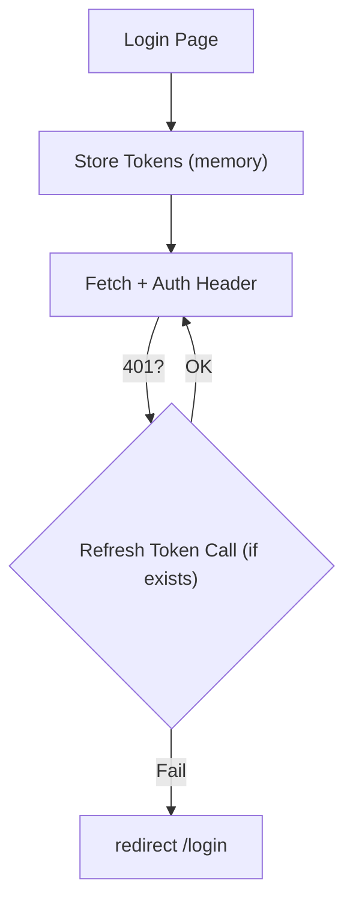

## Context

The backend (`apps/api`) is an Express.js scaffold with 18 route handlers that operate on in-memory arrays. Auth is mocked (string literal tokens, hardcoded `currentUserId`). The frontend (`apps/web`) is a fully built Next.js app with 14 pages but all data sources are mock objects. Both apps share types via `libs/shared`.

This change replaces the in-memory layer with PostgreSQL + Prisma, implements real JWT authentication, and wires the frontend to call the real API. The existing API route structure and response shapes are preserved where possible to minimize frontend changes.

## Goals / Non-Goals

**Goals:**

- Replace in-memory data with PostgreSQL via Prisma ORM
- Implement JWT-based authentication (register, login, refresh, logout)
- Add auth middleware that protects all `/v1/*` routes except auth and health
- Replace mock data in frontend with real API calls
- Add AuthContext to frontend for token management
- Keep existing API response shapes compatible with frontend types

**Non-Goals:**

- OAuth (Google/Apple) — deferred to Phase 2+
- Group CRUD with membership — deferred to Phase 2
- Recipe visibility/privacy enforcement — deferred to Phase 2
- Full-text search — deferred to Phase 4
- File uploads (avatars, recipe images) — deferred
- Email verification, password reset — deferred
- Frontend auth page redesign (keep existing UI)

## Decisions

### Decision 1: Prisma over Drizzle ORM

**Choice:** Prisma.

**Rationale:** Prisma provides a mature migration system (`prisma migrate dev`), auto-generated typed client, and strong ecosystem. The schema-first approach makes the data model explicit and reviewable as a single file. Drizzle is lighter and closer to SQL, but for this project's relational complexity (users → recipes → ingredients → groups), Prisma's relation API is more ergonomic.

**Alternatives considered:** Drizzle (lighter, SQL-like), Knex (query builder, no typed client), raw `pg` driver (maximum control, maximum boilerplate).

### Decision 2: JWT access + refresh token pair

**Choice:** Short-lived access tokens (15 min) + long-lived refresh tokens (7 days) stored in database.

**Rationale:** Access tokens are stateless JWT (no DB lookup per request). Refresh tokens enable long sessions without re-login. Token rotation on each refresh limits exposure window of a stolen refresh token. Storing refresh tokens in DB enables server-side revocation (logout, password change).

**Token structure:**

```
Access token payload:  { sub: userId, iat, exp }
Refresh token:         crypto.randomBytes(48).toString('hex')
```

**Alternatives considered:** Session cookies (simpler but needs session store, less mobile-friendly), opaque bearer tokens (DB lookup every request, slower).

### Decision 3: bcrypt for password hashing

**Choice:** bcrypt with cost factor 12.

**Rationale:** Industry standard. Resistant to GPU attacks. Cost factor 12 balances security (~300ms hash time) with login responsiveness. No additional dependencies needed beyond `bcrypt` npm package.

### Decision 4: Auth middleware as Express middleware function

**Choice:** A single `authMiddleware` function exported from `apps/api/src/middleware/auth.ts`. Applied via `router.use(authMiddleware)` on `/v1` after mounting auth and health routes.

**Pattern:**

```typescript
app.use('/health', healthRouter); // no auth
app.use('/v1/auth', authRouter); // no auth
app.use('/v1', authMiddleware); // guard
app.use('/v1', apiRouter); // protected routes
```

**Rationale:** Simple, explicit. Routes that need to be public are mounted before the middleware. No per-route opt-out annotations needed.

### Decision 5: Ingredients as separate table (not JSONB)

**Choice:** `Ingredient` table with `recipeId` FK. Replace strategy on update (delete all, insert new).

**Rationale:** Separate table enables future ingredient-based search (`WHERE ingredient.name ILIKE '%chicken%'`). JSONB would require `jsonb_array_elements` or full table scan. The current `Ingredient` type (name, unit, quantity) is flat enough that a junction table adds minimal complexity.

### Decision 6: Frontend auth context with token auto-refresh

**Choice:** React Context (`AuthContext`) wrapping the app. Stores `user`, `accessToken`, `refreshToken`. Includes `login()`, `register()`, `logout()`, and automatic token refresh via interceptor pattern.

**Rationale:** Minimal change to existing component tree. The context provides `isAuthenticated` boolean for route guards. Token refresh happens transparently — if a 401 is received and a refresh token exists, attempt refresh then retry the original request.

**Auth flow:**



### Decision 7: Remove computed fields from shared type

**Choice:** `isAuthor` and `isSaved` become server-computed fields in API responses, not stored in DB or defined as required in the shared `Recipe` type. Mark them optional.

**Rationale:** These are request-context dependent (different for each user). The DB stores facts (`authorId`, `savedByIds`). The API computes presentation fields per-request. Frontend types already match this (both fields are optional `?`).

## Risks / Trade-offs

- **[Risk] Prisma cold start latency** → Prisma client initialization adds ~200ms to cold Lambda starts if deployed serverless. Mitigation: not relevant for current Express-on-VPS model. Revisit if migrating to Lambda.
- **[Risk] Token stored in memory (not httpOnly cookie)** → XSS could extract tokens. Mitigation: use httpOnly cookies in production; for MVP, memory storage is simpler and frontend is SPA. Add `SameSite=Strict` cookies in follow-up.
- **[Trade-off] Ingredients replace strategy** → On recipe update, all old ingredients are deleted and re-inserted. This means ingredient IDs change. OK for MVP since ingredients are not independently referenced.
- **[Trade-off] No rate limiting** → Login/register endpoints have no rate limiting. Mitigation: acceptable for MVP with small user base. Add `express-rate-limit` in future phase.

## Migration Plan

1. Add Prisma + PostgreSQL dependencies to `apps/api/package.json`
2. Create `apps/api/prisma/schema.prisma` with all tables
3. Run `prisma migrate dev` to apply schema
4. Remove `apps/api/src/data.ts` (in-memory data)
5. Create `apps/api/src/lib/prisma.ts` (single Prisma client instance)
6. Deploy requires PostgreSQL instance:
   - Development: Docker `postgres:16` container
   - Production: Supabase free tier or Neon free tier
7. Rollback: revert commit, old in-memory data.ts still exists in git history. No data migration needed (there is no production data).

## Open Questions

- OAuth (Google/Apple) — implement now or defer to Phase 2? Decision: defer. Stub endpoints remain (return 501).
- PostgreSQL hosting for production — Supabase vs Neon vs Railway? Decision: document options, let deployment config decide. Dev uses local Docker.
- Should `recipesSharedByOthers` on User remain a stored field or become computed? Decision: become computed in Phase 2 when group sharing is implemented. For now, remove from API response or return 0.
